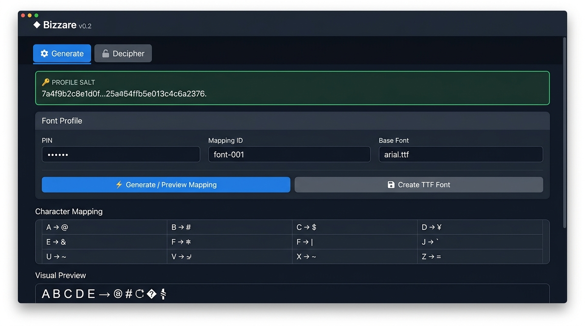
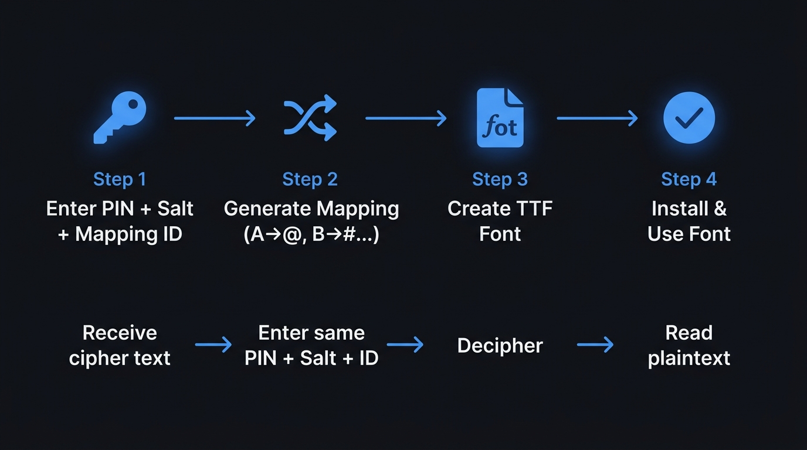
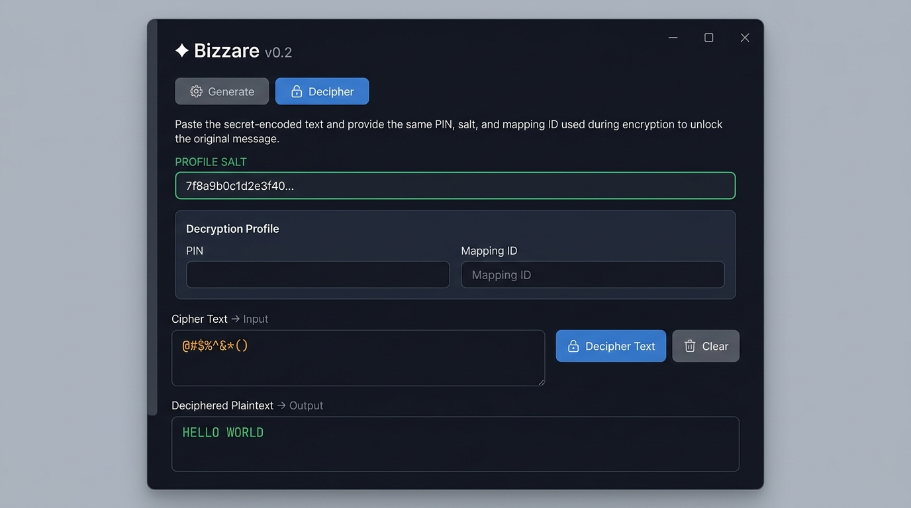

<p align="center">
  
</p>

<h1 align="center">◆ Bizzare</h1>

<p align="center">
  <strong>A visual-obfuscation font generator that makes your plaintext unreadable — unless you have the key.</strong>
</p>

<p align="center">
  
  
  
  
</p>

---

## 📖 What is Bizzare?

**Bizzare** generates a custom Windows-installable TTF font where every letter A–Z is visually replaced by a different symbol (`!@#$%^&*()…`). The mapping is **deterministic and key-dependent** — the same PIN + Salt + Mapping ID always produces the exact same font, allowing two people who share a secret PIN to read each other's "garbled" text.

> **⚠️ Important:** This is a **visual obfuscation layer**, not cryptographic encryption. The underlying Unicode text is still the original plaintext — it only *looks* scrambled when rendered with the Bizzare font.

---

## 🔄 How It Works

<p align="center">
  
</p>

### The Encoding Pipeline

```
PIN (secret, 8+ digits)  ─┐
Salt (public, random hex)  ├──▶  scrypt KDF  ──▶  Master Key  ──▶  HMAC-SHA256 PRF
Mapping ID (public label) ─┘                                           │
                                                                       ▼
                                                              Fisher-Yates Shuffle
                                                                       │
                                                                       ▼
                                                         A→@  B→#  C→$  D→%  …
                                                                       │
                                                                       ▼
                                                              Remapped TTF Font
```

| Component | Role | Secret? |
|-----------|------|---------|
| **PIN** | Your secret key (8+ digits) | ✅ Yes — never share |
| **Salt** | Random value binding PIN to a profile | ❌ No — share freely |
| **Mapping ID** | Label identifying this particular font | ❌ No — share freely |
| **Master Key** | Derived via `scrypt(PIN, salt)` | 🔒 Internal only |
| **Mapping** | The A→symbol permutation | 🔒 Internal only |

---

## 🚀 Quick Start

### Prerequisites

| Requirement | Version |
|-------------|---------|
| Python | 3.10 or higher |
| fonttools | Latest (auto-installed on first run) |

### Installation

```bash
# 1. Clone or download this repository
git clone https://github.com/yourusername/Bizzare.git
cd Bizzare

# 2. (Optional) Install the dependency ahead of time
python -m pip install fonttools

# 3. Run the application
python SecretFont.py
```

> **💡 Tip:** If `fonttools` isn't installed, Bizzare will prompt you to install it automatically on launch — no manual setup needed.

---

## 🖥️ Using the Application

Bizzare has two tabs: **Generate** and **Decipher**.

### ⚙️ Generate Tab — Create a Secret Font

<p align="center">
  
</p>

#### Step-by-step:

1. **Note your Profile Salt**
   - A random salt is generated on launch (shown in the green panel)
   - Click **📋 Copy** to copy it — you'll share this with your recipient
   - Click **🔄 New Salt** to regenerate if needed

2. **Enter your PIN**
   - Must be **8 or more digits** (numbers only)
   - This is your **secret** — don't share it in plaintext

3. **Set a Mapping ID**
   - Default is `font-001`
   - Use different IDs to create multiple distinct fonts from the same PIN

4. **Select a Base Font**
   - Bizzare auto-detects system fonts (e.g., `arial.ttf`)
   - Click **Browse…** to manually select a TTF/OTF file

5. **Click ⚡ Generate / Preview Mapping**
   - The character mapping table populates showing every A–Z → symbol mapping
   - The visual preview bar shows what A B C D E … Z looks like in the new font

6. **Click 💾 Create TTF Font**
   - Choose a save location
   - Bizzare creates and **verifies** the TTF file
   - Install the font on Windows and use it in any text editor

---

### 🔓 Decipher Tab — Decode Secret Text

<p align="center">
  
</p>

#### Step-by-step:

1. **Paste the Profile Salt** from the sender (the hex string)

2. **Enter the same PIN** that was used to generate the font

3. **Enter the same Mapping ID** (e.g., `font-001`)

4. **Paste the cipher text** (the garbled symbols) into the input area

5. **Click 🔓 Decipher Text**
   - The plaintext appears in the green output area below

6. **Click 🗑 Clear** to reset both text areas

---

## 💬 Usage Scenario

> **Alice** wants to send a secret message to **Bob**.

```
1. Alice opens Bizzare, enters PIN: 12345678
2. Alice copies her Salt: a4f9b2c8e1d0f325
3. Alice generates mapping with ID: "project-x"
4. Alice creates the TTF font → "Bizzare-project-x.ttf"
5. Alice sends Bob:
   - The Salt:       a4f9b2c8e1d0f325
   - The Mapping ID: project-x
   - The PIN:        (shared separately via secure channel)

6. Bob installs the font, types normally in Notepad → sees symbols
   OR
   Bob uses the Decipher tab with the same PIN + Salt + Mapping ID
   to convert the symbol text back to plaintext
```

---

## 🏗️ Architecture

```
SecretFont.py (single file, ~1400 lines)
├── Dependency Check          Auto-installs fonttools if missing
├── System Font Detection     Scans Windows/macOS/Linux font dirs
├── Cryptographic Engine
│   ├── derive_master_key()   scrypt KDF (PIN + salt → 256-bit key)
│   ├── prf_stream()          HMAC-SHA256 based PRF expansion
│   ├── uniform_index()       Unbiased random integer selection
│   ├── generate_mapping()    Fisher-Yates shuffle → A-Z permutation
│   └── reverse_mapping()     Inverse mapping for deciphering
├── Font Engine
│   ├── remap_font()          Rewrites cmap tables in the TTF
│   └── verify_generated_font()  Post-save verification
└── UI (tkinter)
    ├── Generate Tab           PIN → Mapping → TTF creation
    └── Decipher Tab           Symbol text → Plaintext conversion
```

### Key Design Decisions

| Decision | Rationale |
|----------|-----------|
| **Single-file** | Zero-friction distribution — just share one `.py` file |
| **scrypt KDF** | Memory-hard key derivation resistant to brute-force |
| **HMAC-SHA256 PRF** | Deterministic, cryptographically strong randomness |
| **Fisher-Yates shuffle** | Guaranteed unbiased permutation |
| **Post-save verification** | Reloads the TTF to confirm mappings are correct |
| **Auto font detection** | No manual font selection needed on most systems |

---

## 🔐 Security Model

### What Bizzare IS:
- ✅ A **visual obfuscation** tool — text *looks* like random symbols
- ✅ **Deterministic** — same inputs always produce the same font
- ✅ Uses real cryptographic primitives (scrypt, HMAC-SHA256)
- ✅ PIN must be 8+ digits

### What Bizzare is NOT:
- ❌ **Not encryption** — the underlying Unicode codepoints are unchanged
- ❌ A copy of the plaintext exists in the document's raw bytes
- ❌ Anyone with the font file can reverse-engineer the mapping
- ❌ Not a replacement for PGP, Signal, or proper E2E encryption

> **Use case:** Casual visual privacy — making text unreadable at a glance, not protecting it from a determined adversary.

---

## 🧩 Character Mapping Reference

Bizzare maps the 26 uppercase Latin letters to these 26 visual glyphs (the exact mapping depends on your PIN + Salt + Mapping ID):

| Source Pool | Characters |
|-------------|-----------|
| **Normal (A–Z)** | `A B C D E F G H I J K L M N O P Q R S T U V W X Y Z` |
| **Visual Glyphs** | `! @ # $ % ^ & * ( ) - _ = + [ ] { } ; : , . ? / < >` |

Both uppercase and lowercase letters map to the **same** visual glyph (i.e., `A` and `a` both render identically in the secret font).

---

## 🛠️ Troubleshooting

| Problem | Solution |
|---------|----------|
| **"fonttools not found"** | Run `python -m pip install fonttools` manually |
| **No base font detected** | Click **Browse…** and select a `.ttf` file from `C:\Windows\Fonts` |
| **"PIN must contain digits only"** | Remove any non-numeric characters from the PIN |
| **"PIN must contain at least 8 digits"** | Use a longer PIN (minimum 8 digits) |
| **Font verification failed** | Try a different base font — some fonts lack required glyphs |
| **Decipher produces wrong output** | Verify the PIN, Salt, AND Mapping ID all match exactly |
| **App won't launch** | Ensure Python 3.10+ is installed: `python --version` |

---

## 📁 Project Structure

```
SecretFont_V0_1/
├── SecretFont.py        # The entire application (single file)
├── README.md            # This documentation
└── assets/
    ├── generate_tab.jpg    # Generate tab screenshot
    ├── decipher_tab.jpg    # Decipher tab screenshot
    └── workflow_diagram.jpg # Workflow infographic
```

---

## 📋 API Reference (for developers)

If you want to use the cryptographic engine programmatically:

```python
from SecretFont import (
    new_salt,
    derive_master_key,
    generate_mapping,
    reverse_mapping,
    remap_font,
)
from pathlib import Path

# 1. Create a salt
salt = new_salt()  # 16 random bytes

# 2. Derive a key from PIN + salt
key = derive_master_key("12345678", salt)  # 32-byte key

# 3. Generate the A→symbol mapping
mapping = generate_mapping(key, "my-font-001")
# → {'A': '@', 'B': '!', 'C': '#', ...}

# 4. Create the font file
remap_font(
    base_font_path=Path("C:/Windows/Fonts/arial.ttf"),
    output_path=Path("./MySecretFont.ttf"),
    mapping=mapping,
    family_name="Bizzare my-font-001",
)

# 5. Reverse a mapping (for deciphering)
rev = reverse_mapping(mapping)
# → {'@': 'A', '!': 'B', '#': 'C', ...}

cipher = "@!#"
plain = "".join(rev.get(ch, ch) for ch in cipher)
# → "ABC"
```

---

## 📄 License

This project is provided as-is for educational and personal use.

---

<p align="center">
  <strong>◆ Bizzare v0.2</strong> — Visual obfuscation through font remapping
</p>
